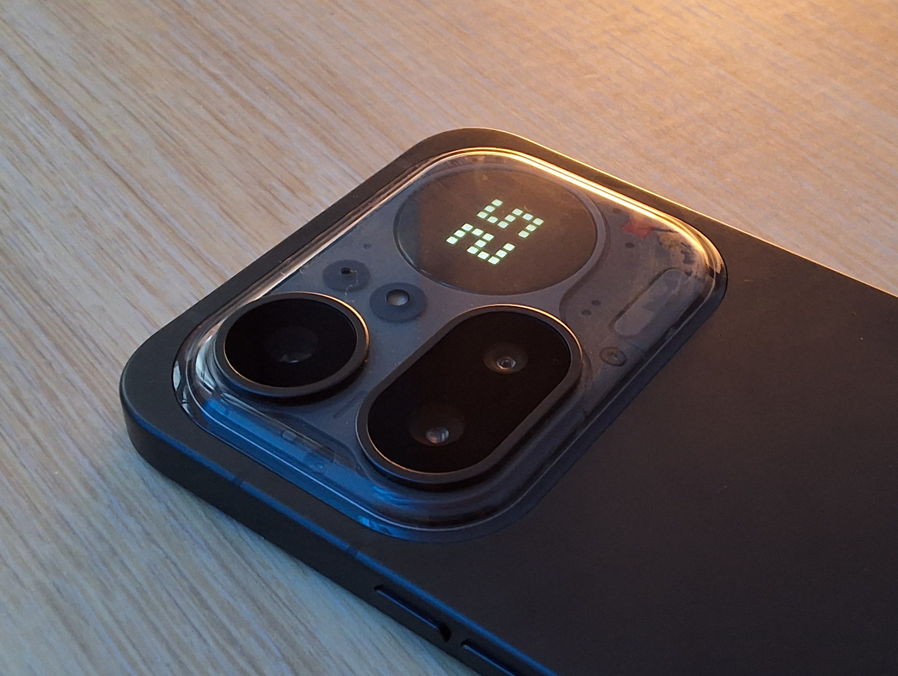

# Glyph Pomodoro

A Pomodoro timer that lives on the **Glyph Matrix** of the Nothing **Phone (4a) Pro** —
controlled by shaking the phone.

<!-- 📸 Add a photo of the toy running on the matrix here -->

  

## How to use
- Download the [newest release](https://github.com/itsmixu/glyph-pomo/releases), and install it. Grant the notification permission.
- Enable in **Settings → Glyph Interface → Flip to Glyph → Always-on Glyph Toy** → select **Pomodoro**.
- Put the phone face down and shake to start the timer.
- Shake to pause, shake longer to reset. After resetting shake to start a new session.
- When on break, the timer has a circle.
- The timer stays in the background even if you pick up your phone, but it is only lit when the phone is face-down (by default).
- Within the app you can customize everything from the digit fonts, to the icons (or even make them animated!), the shake sensitivity and brightness.

_Enjoy! :D_
